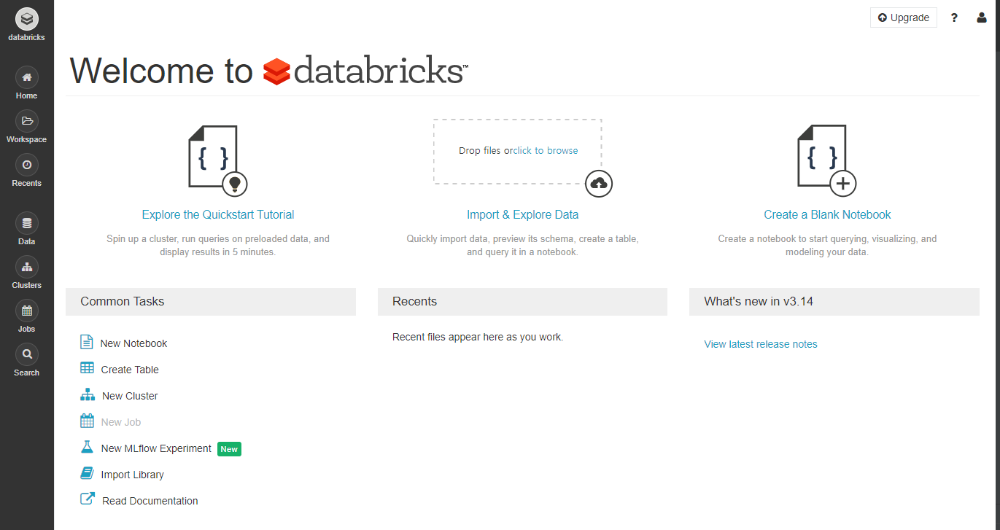

# 1. Databricks Cloud 가입하기

    - Databricks Cloud 

```
데이터브릭스 클라우드는 데이터브릭스라는 기업에서 만든 제품으로, 클라우드 환경에서 Spark를 사용할 수 있게 해 주는 제품
클라우드(Cloud Computing)는 다양한 정의가 있을 수 있지만, 우선 업체에서 가지고 있는 컴퓨터 자원을 사용자에게 사용할 수 있도록 제공해주는 서비스
```

    - 가입하기 
    
```
가입 url : https://databricks.com/try-databricks
```

- COMMUNITY EDITION 클릭 -> 정보입력 및 회원가입 완료하기

</img> <br>

- 가입완료 화면 

</img> <br>

```
내용 설명 (강의에 있는 내용 그대로 복붙)
Databricks Cloud UI
상단
- Explore the Quickstart Tutorial : Quickstart 튜토리얼 문서로 이동합니다
- Import & Explore Data : 데이터를 올리고 노트북을 시작합니다
- Created a Blank Notebook : 빈 Notebook을 시작합니다

- Common Tasks : 노트북 생성, 데이터 업로드, Table 생성, 클러스터 생성, 라이브러리 Import, 문서 보기 등
- Recents : 최근 사용한 노트북이 보입니다
- What's new in v2.100 : 최근 추가된 기능을 보여줍니다
```

# 02. 가상 Cluster 생성하기

- Clusters - Create Cluster를 클릭

</img> 
</img> <br>

- Cluster 생성하기

```
- Cluster Name을 지정하고 저장합니다. 여기서는 pyspark-cluster로 하겠습니다.
- Create Cluster 클릭해주세요. 조금 기다리면 State가 Pending에서 Running으로 바뀝니다.
- 참고로 Community Edition에서 생성된 Cluster들은 2시간 뒤에 자동으로 종료됩니다!
```

</img> <br>

# 03. 가상 Cluster에 라이브러리 설치하기

```
라이브러리는 Maven, PyPI, Upload, CRAN, Workspace, DBFS/S3을 통해 설치할 수 있습니다.
Maven과 PyPI에서 라이브러리를 설치
```

- 클러스터의 이름을 클릭

</img> <br>

- Libraries ->  Install New 클릭

</img> <br>

- Graphframes 설치

```
 Graph 알고리즘을 Apache Spark에서 사용할 수 있게 해주는 라이브러리
```

</img> <br>

- 아래처럼 클릭 후 install 클릭

</img> <br>

> Python Package 설치하기

- 판다스 설치

</img> <br>

# 04. Databricks Cloud Notebook 사용하기

- 노트북 생성하기

</img> <br>

```
Cluster에는 방금 전에 만든 pyspark-cluster 값이 선택되어 있는데, 이렇게 되면 notebook이 해당 cluster에 붙은(attached) 상태로 생성되는 것을 뜻한다.
-> 가장 하단에 있는 옵션이 클러스터 선택!
선택된 클러스터를 삭제하거나 분리(detached)하면 notebook은 사용 불가
+ 클러스터를 띄우지 않은 상태에서 notebook을 생성하면 클러스터 선택 메뉴가 보이지 않는다. 
```

```
# 코드를 python으로 싱행한다고 명시
%python
# 아래는 python 코드
value = 'Spark'
print("This! is%s Notebook!" % value)
```

</img> <br>

# 05. Amazon Web Service Access Key 가져오기

### 강의에서는 AWS를 사용하나 이미 AWS무료 사용량을 다써서 로컬로 도전해보자!


