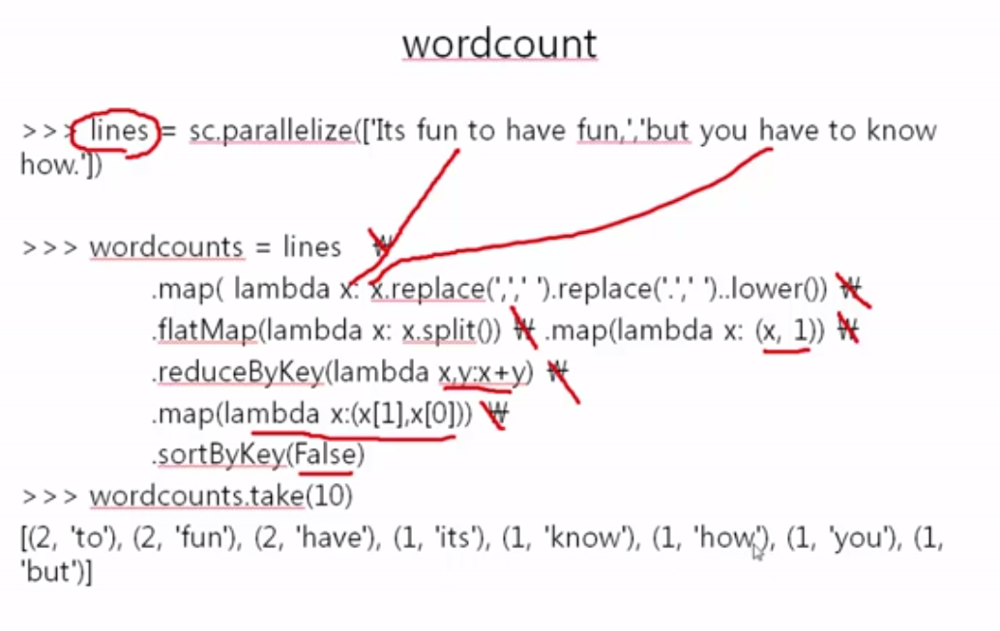

# 24-25. 정규식

> 알고있는 내용과 많이겹처 알고있는 내용은 생략

```
ex)
x* : 0개 이상의 x와 매칭
x+ : 1개 이상의 x와 매칭
x? : 0개 또는 1개의 x와 매칭
x{m, n} : m개 이상 n개 이하의 x와 매칭

\d : 정수와 매칭
\D : 정수가 아닌 것과 매칭
\w : 문자 숫자와 매칭 [a-zA-Z0-9_]
\W : 문자와 숫자가 아닌것 매칭 ^\w
\b : 단어의 경계아 매칭
\B : 단어의 경계가 아닌것과 매칭
```

> python 에서 사용하기

```
import re
    - r1 = re.search("regres","target text")
r1.group()
r1.start()
r1.end()
r1.span()

    - r1 = re.match("regres","target text")
r1.group()

```

# 26-29. 정규식을 사용하는 Spark 프로그램

> 정규식을 이용하여 빅데이터를 처리하는 예제 

```
log file 에서 regex를 통해 데이터를 뽑아내는 작업을 많이 하게됨
웹로그를 파싱하는 예제이나 딱히 어려워보이는게 없어서 설명 생략
```
> 워드 카운트 복습 전체 예시 

</img> <br>


