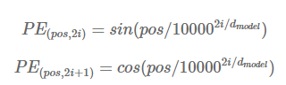

# 9. 생성 모델링의 미래

> 생성 모델의 역사 <br>

</img> <br>

```
** 위 책의 사진은 대략적인 것이며 많은 생략된 모델이 있음
```

### 9.2 트랜스포머

> 트랜스 포머는 2017년 "Attention is All You Need" 논문에서 처음 소개

```
복잡한 순환 구조나 합성곱 구조를 사용하지 않고 순차 모델링(sequential modeling)을 위한 강력한 신경망을 소개
구글의 BERT, GPT-2, MuseNet등에서 사용
```

> 위치 인코딩

```
단어는 먼저 임베딩 층을 통과해 d(model) 512 (설정하기 나름) 길이의 벡터로 변환됨.
그러나 순환 층을 사용하지 않음으로 문장에 있는 단어의 위치를 인코딩해야 한다.
그래서 아래와 같은 위치 인코딩(position encoding)함수를 사용해 문장에 있는 단어의 위치 pos를 d(model)길의의 벡터로 변환
```

- 수식 <br>

</img> <br>

```
i가 작으면 삼각 함수의 파장이 짧아지므로 함숫값은 위치 축을 따라 빠르게 변한다.
i가 큰값이면 더 긴 파장을 만든다.
-> 이 임베딩은 어떤 pos값에도 적용할 수 있기 때문에 입력 시퀀스의 길이에 상관없이 어떤 위치도 인코딩할 수 있다.

나머지 설명은 생략 -  한국어임베딩 책에서 이미 정리
```


> MuseNet

```
MuseNet(http://bit.ly/31hT2vl)은 오픈 AI에서 공개한 음악 생성에 트랜스포머 구조를 적용한 모델

음악 생성 작업에서는 음악이 생섬됨에 따라 시퀀스의 길이인 N이 커짐. -> 계산량 극대화
이 문제를 해결하기 위해 희소 트랜스포머(Sparse Transformer)를 사용(어텐션 행렬의 각 출력 위치는 일부 입력 위치에 대한 가중치만 계산)
```

### 9.3 이미지 생성 분야의 발전

> 1. ProGAN

```
ProGAN(Progressive GAN)은 NVIDIA 연구소에서 GAN 훈련의 속도와 안전성을 향상시키기 위해 개발한 기술

1. 저해상도 4*4 필셀의 이미지에서 생성자와 판별자를 먼저 훈련 
2. 점차 훈련을 진행하면서 층을 추가하여 해상도를 높임 
(먼저 추가된 층이 훈련 과정에서 동결되지 않고 계속 전체를 훈련)
-> 이러한 훈련 메커티즘을 LSUN 데이터셋 이미지에 적용하여 좋은 결과를 얻어냄
```

> 2. SAGAN

```
SAGAN(Self-Attention GAN)은 트랜스포머와 같이 순차 모델에 사용되는 어텐션 메커티즘을 이미지 생성을 위한 GAN기반 모델에 적용
```

> 3. BigGAN

```
BigGan은 DeepMind에서 개발한 모델로 SAGAN논문의 아이더를 확장하여 좋은 결과를 얻어냄

    - 절단 기법(truncation trick)을 사용
훈련할 때 잠재 벡터의 분포로 z ~ N(0,1)을 사용하지만 샘플리에서는 절단 정규 분포(truncated normal distribution)를 사용
(어떤 입곗값보다 작은 z를 샘플링)
절단 입곗값이 적을수록 다양성은 줄어들지만 생성된 샘플링의 신뢰도는 커짐

    - BigGan은 규모가 매우 큼
배치 크기는 2048로 SGAN 보다 8배 크다.
각 층의 채널 크기도 50% 증가

* 공유 임베딩(shared embedding), 직교 정규화(orthogonal regularization)가 포함되어 있음.
```

shared_embedding<br>

</img> <br>

> 4. StyleGAN

```
NVIDA 연구소에서 개발한 모델
ProGAN과 뉴럴 스타일 트랜스퍼를 사용
GAN을 훈련할 때 잠재 공간의 벡터를 이에 대응되는 고수준 속성으로 구분하기 어려움.
(ex) 얼굴의 주름을 추가하고 싶을때 다른 배경을 그대로 유지하기 어려움)

    - 적응적 인스턴스 정규화 (adaptive instance normalization)
레퍼런스 스타일 편항과 스케일을 사용하여 합성 네으쿼으 안의 층에서 출력된 특성 맵 x의 평군과 분상르 조정하는 신경망 층의 한 종류

... 너무 어려워서 생략 
```

> 적용 분야

```
1. AI 아트
2. AI 음악
3. 
```


