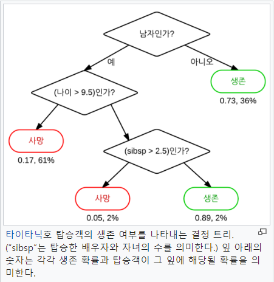

# 4장 분류

## 2. 결정 트리

> 결정트리 (Decision Tree) <br>
>> ML 알고리즘 중 지관적으로 이해하기 쉬운 알고리즘.
>> 데이터에 있는 규칙을 학습을 통해 자동으로 찾아내 Tree 기반으로 분류 규칙을 만드는 것.
>> ex) if, else 를 자동으로 찾아내 예측을 위한 규칙을 만드는 알고리즘 

</img> <br>
>> 출처 wiki <br>
```
    - 위 예의 사진을 통한 결정트리 개념 설명
규칙 노드 (Decision Node) : 규칙 조건   ex) 남자인가?
리프 노드 (Leaf Node) : 규칙 노드를 통해 결정된 클래스 값
서브 트리(Sub tree) : 새로운 규칙 조건마다 서브 트리가 생성됨

이러한 노드들을 추가하여 불균형하게 나눠주는 결정들을 찾아야 한다.  
-> 균일도가 높아야한다 (각 분류된 결과에 하나의 결과로만 이루어 질수록 좋다)
==> 즉, 정보 이득 지수와 지니 계수를 통해 구할 수 있음.(지니 계수가 1(높은)수가 되도록 한다)

    - 결정 트리의 장단점
- 장점
정보의 "균일도"라는 룰을 기반으로 하고있어 알고리즘이 쉽고 직관적이다.
시각화가 가능하다.
피처의 스케일링과 정규화 작업이 필요가 없다
- 단점
과적합으로 정확도가 떨어진다.
피처가 많고 균일도가 다양하게 존재할수록 트리의 깊이가 커지고 복잡해진다.

    - 결정 트리 파라미터
* 사이킷런 기준
- min_smaples_split
노드를 분할하기 위한 최소한의 샘플 데이터 수 (과적합 제어에 좋음)
default : 2  
- min_smaples_leaf
말단 노드(Leaf)가 되기 위한 최소한을 샘플 데이터 수 (과적합 제어에 좋음)
비대칭적 데이터의 경우 특정 클래스의 데이터가 극도로 작을 수 있음으로 작게 설정해야한다.
- max_features
최적의 분할을 위해 고려할 최대 피처 개수  
defalut : None  -> 고려 안함
sqrt, auto : 루트(전체 피처 개수)
log : log2(전체 피처 개수) 
- max_depth
트리의 최대 깊이를 규정
- max_lef_nodes
말단 노드의 최대 개수
```

> 결정 트리 모델의 시각화

```
Graphviz 패키지를 이용하는 방법이 있음
=> 굳이 보고싶지 않음으로 이부분은 패스
아래 링크 참조 
https://github.com/wikibook/ml-definitive-guide/blob/master/4%EC%9E%A5/4.2%20%EA%B2%B0%EC%A0%95%20%ED%8A%B8%EB%A6%AC.ipynb
```

> 결정 트리 시습 - 사용자 행동 인식 데이터 세트
```
UCI 머신러닝 리포지토리(Machine Learning Repository)에서 제공하는 사용자 행동 인식 데이터 세트(Human Activity Reconition) 데이터 세트 사용
url : http://archive.ics.uci.edu/ml/datasets/Human+Activity+Recognition+Using+Smartphones
코드 ./decision_tree.py  참조
코드 돌린결과 출력 아래 (중요 피처 출력)
```
</img> <br>

## 3. 앙상블 학습
> 앙상블 (Ensemble)
```
    - 앙상블 학습 (Ensemble Learning)
여러 개의분류기(Classifier)를 생성하고 그 예측을 결합함으로써 보다 정확한 최종 예측을 도출하는 기법
* 부스팅 계열의 앙상블 알고리즘의 개발 가속화 (인기 가 많음)

    - 앙상블의 학습 유형
- 보팅(Voting), 배깅(Bagging)
여러개의 분류기기가 투표를 통해 최종 예측 결과를 결정하는 방식.
보팅은 서로 다른 알고리즘을 가진 분류기를 결합
배깅은 각각의 분류기가 모두 같은 유형의 알고리즘 기반 (데이터 샘플링을 다르게 둠)
부트스트래핑(Bootstrapping) 분할 방식 : classifier에게 데이터를 셈플링해서 추출하는 방식
- 부스팅(Boostring)
여러 개의 분류기가 순차적으로 학습을 수행, 앞에서 학습한 분류기가 예측이 틀린 데이터에 대해서는 올바르게 예측할 수 있도록
다음 분류기에는 가중치(weight)를 부여하면서 학습과 예측을 진행.
대표 부스팅 : 그래언트 부스트, XGBoost(eXtra Gradient Boost), LightGBM(Light Gradient Boost)
```
> 보팅 유형 
```
    - 하드 보팅(Hard Voting)과 소프트 보팅(Soft Voting)
- 하드 보팅
다수결의 원칙과 비슷함.
예측한 결괏값들 중 다수의 분류기가 결정한 예측값을 최종 보팅 결괏값으로 선정 

- 소프트 보팅 
분류기들의 레이블 값 결정 확률을 모두 더하고 이를 평균해서 이드 중 확률이 가장 높은 레이블 값을 최종 보팅 결괏값으로 선정
* 일반적으로 소프트 보팅을 많이 사용 

    - 보팅 분류기 (Voting Classifier)
사이킷 런에서 VotingClassifier 클래스를 제공 


```
## 4. 랜덤 포레스트 

> 정의
```
배깅의 대표적인 알고리즘
     - 장점
 앙상블 알고리즘 중 비교적 빠른 수행 속도를 가지고 있다.
 다양한 영역에서 높은? 예측 성능을 보인다.
 결정 트리기반 알고리즘으로서 직좐적인 장점을 그대로 가지고 있다.
```
> 학습 방법
```
개별적인 분류기에 전체 데이터에서 일부가 중첩되게 샘플링된 데이터로 학습.
bootstrapping : 위 처럼 일부 데이터가 중첩되게 분리하는 분할방식
```
> 하이퍼 파라미터 튜닝
```
    - n_estimators
결정 트리의 개수를 지정
default = 10
    - max_features
결정 트리에 사용된 max_features 파라미터와 같음.
default = auto (sqrt) --> default가 다름
    - 나머지 파라미터는 결정트리와 같음
```

## 5. GBM (Gradient Boostring Machine)
```
부스팅 알고리즘 : 여러 개의 약한 학습기를 순차적으로 학습, 예측하면서 잘못 예측한 데이터에 가중치 부여를 통해 오류를 개선해 나가면서 학습하는 방식

에이다 부스트(Ada Boost)는 오류 데이터에 가중치를 부여하면서 부스팅을 수행하는 대표적인 알고리즘.
-> 이전 약학습기에서 잘못 분류한 데이터에 대하여 더 큰 가중치를 부여하여 학습시키는 바업ㅂ
```
> GBM
```
GBM : AdaBoost와 유사하나, 가중치 업데이트를 GD를 이용함 
    - 하이퍼 파라미터 설명
- loss
손실 함수 지정 
default : deviance
- learning_rate 
학습률
default : 0.1
- n_estimators
week learner의 개수
- subsample
week learner가 학습에 사용하는 데이터의 샘플링 비율
1 이면 전체 데이터를 기반으로 학습 
default : 1 
```

## 6. XGboost(eXtra Gradient Boost)
> XGBoost
```
    - 설명
트리 기반의 앙상블 학습에서 가장 곽광받고 있는 알고리즘 중 하나
GBM에 기반하고 있지만, GBM의 단점인 느린시간 및 과적합 규제 부재 등의 문제를 해결함
병렬 CPU환경에서 병렬 학습이 가능해 기존 GBM보다 빠르다.

    - 일반 파라미터 : 일반적으로 실 시 스레드의 개수나 silent 모드 등 선택을 위한 파라미터 (거의 안바꾸는 설정)
- booster 
gbree(ree based model) 또는 gblinear(linear model) 선택
default : gbtree
- slient
출력 메시지를 나타내지 않고 싶은경우 1로 설정
default: 0
- nthread
스래드 개수 조정

    - 주요 부스터 파라미터 : 트리 최적화, 부스팅, 정규화 등과 관련된 파라미터
- eta
학습률 0~1사이 지정
보통은 0.01 ~ 0.2 사이로 지정
default : 0.3
alias : learng_rate
- num_boost_rounds
GBM의 n_estimators와 유사
- min_child_weight
GBM의 min_child_leaf와 유사 
-> 과적합을 조절하기 위해 사용
default : 1
- gamma
트리와 리프 노드를 추자적으로 나눌지를 결정할 최소 손실 감소 값
값이 클수록 과적합 감소 효과가 있음
alias : min_split_loss
default : 0
- max_depth
0 지정시 제한이 없음
보통 3~10이면 숫자가 커지면 과적합 가능성이 커짐 
default : 6
- sub_sample
GBM의 subsample과 동일.
트리가 커져 과적합되는 것을 제어하기 위해 데이터를 샘플링하는 비율을 지정
일반적으로 0.5 ~ 1 사용 가능
default : 1
- colsample_bytree
GBM의 max_features와 유사
트리 생성에 필요한 피처를 임의로 샘플링
default : 1
- lambda
L2 Regularization
alias : reg_lambda
default : 1
- alpha
L1 Regularization
alias : reg_+alpha
default : 0
- scale_pos_weight
특정 값으로 치우친 비대칭한 클래스로 구성된 데이터 세트의 균형을 유지하기 위한 파라미터
default : 1

    - 학습 태스크 파라미터 : 학습 수행 시의 객체 함수, 평가를 위한 지표 등을 설정
- objective
최솟값을 가져야할 손실 함수를 정의
- binary:logistic:
이진 분류일때 사용
- multi:softmax:
다중 분류일 때 사용
num_class 파라미터를 지정해야 사용 가능하다 
- multi:softprob
multi:softmax와 유사, 개별 레이블 크래스의 해당되는 예측 확률을 반환
- eval_metric
검증에 사용되는 함수를 정의
default : 회기 - rmse , 분류 - error
   rmse : Root Mean Square Error
   mae : Mean Absolute Error
   logloss : Negative log-likelihood
   error : Binary classification error rate (0.5 threshold)
   merror : Multiclass classification error rate
   mlogloss : Multiclass logloss
   auc : Area under the curve
   
    - 과적합 시 파라미터 튜닝시 추천 값
1. eta를 낮춘다. 
eta 값을 낮출 경우 num_round or n_estimators는 반대로 높여줘야한다.
2. max_depth 값을 낮춘다
3. min_child_weight 값을 높인다.
4. gamma 값을 높인다.
5, subsample 과 colsample_bytree를 조정한다.
```

# 7. LightGBM
> LightGBM
```
    - LightGBM 설명
XGBoost와 함께 부스팅 계열 알고리즘에서 가장 각광을 받고 있다.
XGBoost보다 학습시간을 단축하고 메모리 사용량도 사용량도 적게 사용한다.
* 예측 성능이 XGBoost보다 떨어지지 않음
일반 GBM 계열의 트리 분할 방법을 쓰지 않고, 리프 중심 트리 분할(Leaf Wise)방식을 사용
트리의 균형보다 최대한 손실 값을 가지는 리프 노드를 지속적으로 분할하면서 트리의 깊이가 깊어지고 비대칭적인 규칙 트리가 생성된다.

    - LightGBM 특징 정리
더 빠른 학습과 예측 수행 시간
더 작은 메모리 사용량
카테고리형 피처의 자동 변환과 최적 분할 (원 핫 인코딩이 아닌 카테고리형 피처를 최적으로 변환)
GPU사용 지원
```

> LightGBM 하이퍼 파라미터
```
    - 주요 파라미터
- num_iterations
qksqhr tngodgkfusms xmfldml rotn
default : 100
- learning_rate
학습률
default : 0.1
- max_depth
트리 기반의 알고리즘의 max_depth와 같음 
0보다 작은값을 넣으면 제한 없음 
LightGBM은 Leaf wise 기반이므로 깊이가 상대적으로 더 깊음 
default : -1
- min_data_in_leaf
결정 트리의 min_sample_leaf와 같음
default : 20
- mum_leaves
하나의 트리가 가질 수 있는 최대 리프 개수 
default : 31
- boosting
부스팅 트리를 생성하는 알고리즘 기수 
gbdt : 일반적인 그래디언트 부스팅 결정 트리
rf : 랜덤 포레스트
default : gbdt
- bagging_fraction
개별 트리를 학습할 때 무작위로 선택하는 피처의 비율
과적합을 막기 위해 사용
default : 1.0
- lambda_l2, lambda_l1
L1, L2 regulation 제어를 위한 값
default 0.0

    - Learning Task 파라미터
- objective
최솟값을 가져야 할 손실함수를 정의
-
```

> 하이퍼 파라미터 튜닝 방안

```
num_leaves의 개수를 중심으로 min_child_samples, max_depth를 함께 조정하는것이 기본 튜닝 방안
- num_leaves
개별 트리가 가질 수 있는 최대 리프 개수 -> LightGBM 모델의 복잡도를 제어하는 주요 파라미터
커질수록 정확도가 올라가지만 오버피팅이 될 가능성이 있음
- min_data_in_leaf
사이킷런 래퍼 min_child_samples -> 사이킷럿 래퍼 클래스에서의 이름
과적합을 개서한기 위한 중요한 파라미터
큰값으로 설정하면 트리가 깊어지는것을 방지
- max_depth
명시적으로 깊이의 크기를 제한
```


