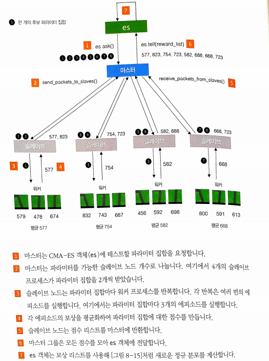

# 8장 게임하기 

> 강화학습의 구조

```
상태(state) 와 행동(action)이 주어졌을 때 다음 상태에 대한 확률 분포를 만드는 생성 모델

무작위로 이동하면서 환경(environment)의 물리적 특성을 이해하고 ㅏㄴ면 모델이 새로운 작업에 대해 처음부터 스스로 훈련할 수 있다.
```

## 8.1 강화학습(Reinforcement Learning) 정의

> 정의

```
강화학습(RL)은 에이전트(agent)가 주어진 환경에서 특정 목적에 대해 최적의 수행을 목표로 하는 머신러닝 분야
주어진 환경에서 에이전트가 받을 장기간 보상(reward)을 최대화하는 것이 목적
강화학습은 머신러닝의 주요한 세 가지 학습 분류 중 하나
```

### 강화학습의 핵심 요소 설명

> 환경(environment)

```
에이전트가 작동하는 세상. 에이전트의 이전 행동과 현재 상태가 주어졌을 때 정의된 일련의 규칙으로 상태 업데이트 과정과 보상 할당을 관장
보상과 벌칙등을 할당
```

> 에이전트 (agent)

```
환경에서 행동을 수행하는 개체
```

> 상태(state)

```
에이전트가 만날 수 있는 특정 상황을 표현하는 데이터
ex) 선수가 기물을 다음 위치로 옮기는 것과 같은 게임의 정보에 따른 체스판 구성
```

> 행동(action)

```
에이전트가 수행할 수 있는 움직임
```

> 보상(reward)

```
행동이 수행되고 나서 에이전트가 환경으로부터 받을 값
에이전트의 목적은 이 보상의 장기간 합을 최대화 하는것
```

> 에피소드(episode)

```
에이전트가 환경에서 1회 실행. 롤아웃(rollout)이라고도 부른다.
```

> 타임스텝(timestep)

```
이산적인(discrete) 이벤트 환경을 위해 모든 상태, 행동, 보상의 값은 타임스텝 t의 첨자로 표시
```

</img> <br>

### 8.1.1 오픈 AI Gym

> 오픈 ai gym 설명

```
강화학습 알고리즘을 개발하기 위한 파이썬 라이브러리
https://gym.openai.com/
```

### 8.2.2 MDN-RNN

```
미래를 고려하는 알고리즘
ex) 도로가 왼쪽으로 휘어져 있으면 기을 따라 핸들을 왼쪽으로 돌려 차와 도로를 나란히 맞춤 
네트워크는 이전 잠재 상태와 행동을 기반으로 다음 잠재 상태의 분포를 예측
257개의 은닉 유닛을 가진 LSTM 층
```

### 8.2.3 컨트롤러

```
행동 선택을 담당
완전연결신경망으로 구축
```


## 8.3 환경 설정하기 

```
책내용에는 명령어 한줄이지만 윈도우라서 실행이 불가능 ㅠ 
git 링크 - https://github.com/AppliedDataSciencePartners/WorldModels
git clone 후 requirements.txt 설치
    - windows 에서 box2d 를 설치하기 위해서는  swing 설치해야함
https://sourceforge.net/projects/swig/files/swigwin/swigwin-3.0.2/swigwin-3.0.2.zip/download
다운로드 후에 환경변수에 추가하기 
환경변수 적용 후 pip install box2d box2d-kengz
    - 버전이 안맞으면 실행이 안됨
pip install pyglet==1.3.2 --upgrade
```

### 8.4 데이터 수집

```
git의 해당 내용에서 
generate_data.py <1.env_name> --total_episodes <2.total_episodes> --time_steps <3.time_steps> --render <4.render> --action_refresh_rate <5.action_refresh_rate>

<1.env_name> : make_env 함수에서 사용할 환경 이름 
<2.total_episodes> : 프로세스마다 실행할 에피소드 개수 
<3.time_steps> : 에피소드마다 최대 타임스텝 횟수
<4.render> : 롤아웃 과정을 GUI로 보려면 1 아니면 0
<5.action_refresh_rate> : 현재 행동을 바꾸지 않고 동결할 타임스텝 횟수.(행동이 너무 빨리 바뀌는것을 막아줌)

실행 예시
python3 car_racing --total_episodes 125 --time_steps 300 --render 0 --action_refresh_rate 5
# env_name car_racing 은 고정인듯 (코드에 박혀있어서)  

실행 데이터는 받은 git 프로젝트의 ./data/rollout/ 에 저장됨
```

> 실행 화면

</img> <br>

### 8.5 VAE 훈련 및 구조

> 8.4에서 수집한 데이터로 부터 데이터 생성 모델(VAE) 생성

```
python 02_train_vae.py --new_model [--N] [--epochs]

    - 매개변수 설명
--new_model
모델을 처음부터 훈련할지를 지정
파라미터를 지정하지 않으면 ./vae/vae.json 파일을 찾아 이전 모델의 훈련을 이어감
--N
선태사항 
VAE훈련에 사용할 에피소드 개수
--epochs
선택사항
훈련 에폭 개수
```

#### VAE 구조

> 중요 개념 설명

```
    - full_model
훈련할 end-to-end의 전체 모델
    - encoder
해당 모델은 64*64*3 크기의 관측을 입력으로 받고 샘플링된 z벡터를 출력
동일한 입력으로 모델의 predict 메서드를 여러 번 호출하면 mu와 log_var값이 일정하더라도 z벡터가 랜덤이기떄문에
다른 출력을 얻음
    - encoder_mu_log_var
64*64*3 크기의 관측을 입력으로 받고 입력에 대응되는 mu와 log_var 벡터를 출력
encoder 모델과 달리 이 모델을 여러 번 호출하면 동일한 출력을 얻을 수 있음 
(출력 mu log_var의 길이는 32)
    - decoder
z벡터를 입력으로 받아 64*64*3크기의 재구성된 관측을 반환
```

</img> <br>

### 8.6 RNN 훈련 데이터 수집 후 MDN-RNN

> MDN_RNN 구조

</img> <br>

> MDN_RNN 설명

```
LSTM 층과 그 뒤에 놓인 완전 연결층(MDN)으로 구성되어 있음
왼전 열결 층은 LSTM의 은닉 상태로 혼합 분포(mixture distribution)에 파라미터로 변환

- LSTM
길이가 36인 벡터
VAE로 부터 인코딩된 z 벡터(길이 32), 현재 행동(길이 3), 이전 보상(길이 1)을 연결
출력은 길이가  256인 벡터 LSTM층의 출력마다 하나의 값을 가져감 
- MDN
길이가 256인 벡터를 길이가 481인 벡터로 변환
이유 : 각 분포에서 z의 벡터 32개 차원마다 mu와 log_sigma, 분포가 선택될 확률(log_pi)가 필요
즉, 5*3*32 = 480 과 보상 예측  481개의 아웃풋이 필요
```

> 보상과 샘플링

```
1. 481차원의 출력 벡터를 3개의 변수(log_pi, mu, log_sigma)와 보상값으로 나눔
2. log_pi에 지수 함수적용 후 5개의 혼합 분포 합이 1이되도록 정규화 후 다시 로그 함수 적용
    -> 5개의 혼합 분포 인덱스에 대한 32개 확률
3. z의 32개 차원을 log_pi의 확률을 기반으로 샘플링
4. 이 분포에 해당하는 mu와 log_sigma를 추출
5. 차원마다 mu와 log_sigma로 정의도는 정규 분포에서 z의 값을 샘플링
6. 보상 로짓값이 0보다 크면 보상1 아니면 0으로 예측 
```

### 8.7 컨트롤러 훈련

> CMA-ES(Covariance Matrix Adaptation Evolution Strategy)

```
CMA-ES라는 진화 알고리즘을 통한 컨트롤러를 훈련
```

> CMA-ES 훈련 전략

```
1. 에이전트의 개체군(population)을 만들고 최적화할 파라미터를 랜덤하게 초기화
2. 다음 과정을 반복
    a. 환경 안에서 여러 에피소드를 수행하여 얻은 평균적인 보상으로 각 에이전트를 평가
    b. 가장 좋은 점수의 에이전트를 사용해 새로운 개체 생성
    c. 새로운 개체의 파라미터에 무작위성을 주입
    d. 새로 만든 에이전트 추가 나쁜 성능 에이전트 제거하는방식으로 개체군을 업데이트
-> 설명을 보면서 적다보니 유전자 알고리즘 
이를 진화 전략(evolutionary strategy)라고 부름.
교배(breeding)는 가장 좋은 점수를 얻은 에이전트를 합쳐 놓은 성능을 낼 수 있는 다음 세대(generation)를 만드는것을 의미
```

> CMA_ES 병렬화

</img> <br>

```
CMA-ES의 장점 중 하나는 데이비드 하가 만든 es.py로 쉽게 병렬화 가능

전체적인 학습은
원본 데이터 수집 -> 원본 데이터로 부터 가상 데이터 생성 -> 가상데이터로 학습
가상데이터를 이용하여 학습하는데 좋은 결과가 나온것을 알 수 있음
=> 월드 모델 논문의 매우 중요한 핵심
생성 모델을 의사환경(pseudoenvironment)으로 사용하여 진화 전략의 정책을 반복적으로 테스트하면 실제 환경에 잘 일반화될 수 있다.
```


