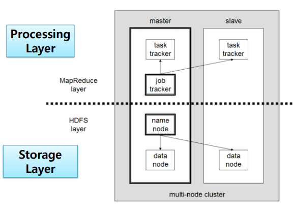

============= 2 주차 ======================  
### 복습  
빅데이터 (사람에 의해서 생긴 데이터들) -> 나중엔 센서에 의해서도 데이터가 생성됨
3V, 빅데이터 분석 과정 

빅데이터 처리 
1. 결함 허용 시스템 (Fault Tolerance)
2. 저 비용 시스템(Cost Effective System)
 - 수직 확장(Scale Up)
 - 수평 확장(Scale out))
3. 기존 시스템과 연계성

    2주치 시작
책 : Haddop The Definitive Guide 책
23P ~ 

많은데이터 > 좋은 알고리즘   

빅데이터 처리 시스템 원조 : 하둡 (Hadoop) -> 역사  
2003 : 구글 파일 시스템 (GFS) <- HDFS가 이걸보고 만듦   
2004 : 구글 맵리듀스 (MapReduce)  
2004 : 아파치 넛지 (Nutch) 프로젝트  
2006 : 야후 하둡 프로젝트 탄생 (더그 커팅)  
2008 : 클라우데라(Cloudera) 창립  
2011 : 호튼웍스 (Hotonworks) 창립 

- 하둡(Hadoop)
> 대용량의 데이터를 분산 병렬 처리 방식으로 여러 개의 작업 노드에 작업을 분산하여 병렬 수행할 수 있는 프레임워크를 제공
Master - Slave(Woker) 구조로 데이터를 분산 처리  
한대가 장애가 나더라도 작업을 분산처리 하기 때문에 결함 허용 시스템이 적용되어 있음  

하둡1.0  
</img>  
Processing Layer(MapReduce layer)과 Storage Layer(HDFS layer)를 나눠서 처리하도록 설계
mater : jab tracker 와 name node가 main 업무
slave : 데이터 처리하도록

Name node : Name Space를 관리하는 노드 

---

## AWS 사용하기 
 학생 계정 AWS</img>  
> AWS student 계정으로 계정 생성하면 100$ 무료 사용 가능

-> trello에 빅데이터 관련 논문 종류별로 업로드 됨 
