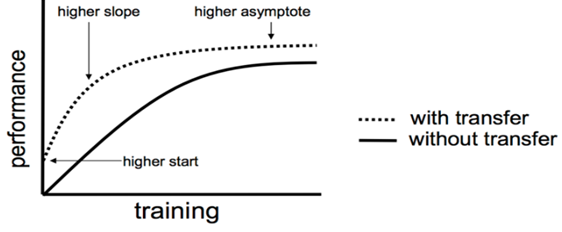
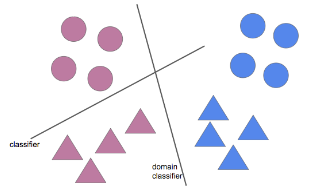

# Pre Training
- 프리 트레이닝(Pre Training) 이란
풀고자 하는 문제와 비슷하면서 사이즈가 큰 데이터로 이미 **범용적으로 잘 학습이 되어 있는 모델**
> 페이지 하단에 Tensorflow 와 Pytorch 코드예제 있음

- generative pre-training -> 제프리 힌톤(Geoffrey Hinton) <br>
    -  **해당 탭은 발생적 사전 훈련 설명** 
    - "A fast learning algorithm for deep belief nets"라는 2006년의 논문 <br>
     -> 해당 논문을 통해 pre-training 을 제시
    -  Unsupervised Learning을 이용한 Pre-training <br>
        - 위의 힌톤 교수가 2006년에 제안한 방벙 
     
# Fine tuning
- 파인 튜닝(Fine-tuning) 이란?
모델의 파라미터를 미세하게 조정하는 행위 <br>
이미 존재하는 모델에 추가 데이터를 투입하여 파라미터를 업데이트하는 것. <br>
- 위키 피디아 설명
파인튜닝은 정교한 파라미터 튜닝이라고 생각하면 되는데 정교한과 파라미터가 키포인트들 이다.
```
개, 고양이를 분류기를 만드는데 다른 데이터로 학습된 모델(VGG16, ResNet 등) 을 가져다 쓰는 경우를 생각해보자.
VGG16 모델의 경우 1000 개의 카테고리를 학습시켰기 때문에 고양이와 개, 2개의 카테고리만 필요한 우리 문제를 해결하는데 모든 레이어를 그대로 쓸 수는 없다.
따라서 가장 쉽게 이용하려면 내 데이터를 해당 모델로 예측(predict)하여 보틀넥 피쳐만 뽑아내고, 이를 이용하여 어파인 레이어(Fully-connected layer) 만 학습시켜서 사용하는 방법을 취하게 된다.
하지만 이 경우는 파인튜닝이라고 부르지 않는다. 피쳐를 추출해내는 레이어의 파라미터를 업데이트 하지 않기 때문이다.
어파인 레이어를 업데이트 하지 않냐고 생각할 수 있지만 내가 새로 구성한 레이어이기 때문에 업데이트가 아니며 초기 웨이트가 랜덤이기 때문에 정교하지도 않다.
** 파인튜닝을 했다고 말하려면 기존에 학습이 된 레이어에 내 데이터를 추가로 학습시켜 파라미터를 업데이트 해야 한다.
이 때 주의할 점은, 정교해야 한다.
완전히 랜덤한 초기 파라미터를 쓴다거나 가장 아래쪽의 레이어(일반적인 피쳐를 학습한 덜추상화된 레이어)의 
파라미터를 습해버리면 오버피팅 이 일어나거나 전체 파라미터가 망가지는 문제가 생기기 때문이다.
```
- 보틀넥 피처(Bottleneck feature) <br>
모델에서 가장 추상화된 피쳐<br>

- 어파인 레이어(AFFINE LAYER)<br>
    - 뉴럴 네트워크에서 완전 연결된 레이어 (fully-connected layer)입니다.
    - Affine은 이전 레이어의 각 뉴런들이 현재 레이어의 각 뉴런들에 연결되어 있음을 뜻합니다.
    - 뉴럴 네트워크의 표준 레이어

# Transfer Learning 
> Transfer Learning 이란
- 기존의 만들어진 모델을 사용하여 새로운 모델을 만들 시 학습을 빠르게 하며, 예측을 높이는 방법 <br>
- 잘 훈련된 pretrainted model을 이용해서 마지막 final layer만 수정해서 본인의 목적에 맞게 다시 학습 시키는 방법. <br>
- 잘 훈련된 모델이 있고, 해당 모델과 유사한 문제를 해결 시 Transfer Learning을 사용 <br>

</img> <br>
> 특정 목적을 가진 학습된 모델을 다른 일의 시작 포인트에서 재사용 하는 것 <br>
</img> <br>

- Transfer Learning, fine tuning 사용 범주<br>
    1. 새로 훈련할 데이터가 적음, original 데이터와 유사한 경우 **(Transfer Learning 사용)** <br>
        - fine-tune(모델 전체에 대하여 backpropagation을 하는 것)은 over-fitting의 위험이 있다.  <br>
        - 새로 학습할 데이터는 original 데이터와 유사하기 대문에 이 경우 최종 linear classifier 레이어만 학습을 한다. (Transfer Learning)
    2. 새로 훈련할 데이터가 많음, original 데이터와 다른 경우
        - 새로 학습할 데이터가 많다 --> 오버피팅 위험이 낮다. --> fine-tune을 진행
    3. 새로 훈련할 데이터가 적음, original 데이터와 다른 경우
        - 최동 단계의 linear classifier 레이어를 학습 + 네트워크 초기부분 activation 이후의 레이어를 학습하는것을 추천한다고 한다.
    4. 새로 훈련할 데이터가 많음, original 데이터와 다른경우
        - 새로 훈련을 하는것 보다 전체 네트워크에 대해서 fine-turn을 하는 것이 더좋은 결과가 많이 나온다고 한다.
        
### Transfer Learning 부가 설명

> Transfer Learning 탄생 배경
>> Breiman이 제안한 Born Again Trees. <br>
>> 앙상블을 통해 여러 모델을 합쳐서 좋은 성능을 내는것은 수학적으로 증명된 사실 이지만, 앙상블의 단점으로 높은 연상량과 모델의 복잡성이 있다. <br>
>> -> 앙상블의 성능을 내면서도 더 간단한 모델을 만들기 위해 생각하기 시작 <br>
>> 앙상블의 효과를 내면서도 의사결정나무의 장점인 해석력을 얻는 기법을 제안. <br>
>> Transfer Learning 이 나온 후 비슷한 기법이 나오기 시작 <br>

> Knowledge distillation  <br>
>> 2015년 제프리 힌튼이 2015년에 발표한 논문  <br>
>> 네트워크의 학습 결과를 softmax를 거쳐 분포를 나타내는데, cut-off를 0.5로 설정하면 이 위의 값들은 1로, 아래 값들은 0으로 라벨을 판별하는데 이런 형태를 hard target이라 하고, 1과0으로 변환되기 전 값을을 soft target이라고 한다.  <br>
>> soft target 분포를 목적으로 전이받는 네트워크를 학습시키면 knowledge transfer가 매우 효율적이라고 주장  <br>

> Born Again Networks
>> 용어  <br>
>> Teacher Network : 먼저 데이터셋에 대해 학습을 한 네트워크  <br>
>> Student Network : Teacher Network를 이용해서 데이터를 학습하는 네트워크  <br>
>> 목적 Student 네트워크가 Teacher 네트워크의 "correct label" 과 "output distribution" 두 목표를 가지고 학습  <br>
>> 해당 논문에서는 Student 네트워크를 "Born Again Network(BAN)"이라 명칭하고 DenseNet에 적용하여 좋은 결과를 얻었다고 한다. (추후 wide-renet도 학습) <br>

> Disentangling Task Transfer Learning  <br>
>> 2018년 4월에 발표한 논문,  CVPR 2018에서 Best Paper Award를 수상 <br>
>> 기존 Transfer Learning은 source task와 target task를 하나씩 정해놓고 둘 간의 transferability(전이성)만을 단편적으로 판단.  <br>
>> 둘 이상의 task들에 대한 전이성을 한 번에 보는것이 해당 논문의 아이디어(논문에서는 Taskonomy 라고 정의)  <br>


# Related Work

- Self-Supervised Learning
    - 레이블링 비용이 상대적으로 낮은 task로부터 학습한 정보를 활용하여, 그와 내재적으로 관련되어 있으면서 레이블링 비용이 더 높은 task에 대한 학습을 시도하는 방법들을 통칭합니다.
    - 셀프 트레이닝 예시
        1. 레이블이 달린 데이터로 모델을 학습시킵니다.
        2. 이 모델을 가지고 레이블이 달리지 않은 데이터를 예측합니다.
        3. 이중에서 가장 확률값이 높은 데이터들만 레이블 데이터로 다시 가져갑니다.
        4. 위 과정을 계속 반복합니다.
    - semi-supervised learning 기법 중 하나

- Meta-Learning
    - 러닝 모델 학습을 meta-level(상위 레벨)에서의 좀 더 ‘추상화된’ 관점으로 조명하고, ‘학습 데이터셋의 종류를 막론하고, 모델을 좀 더 효과적으로 학습하기 위한 일반적인 방법’을 찾아내는 데 초점이 맞춰져 있습니다.
    - Meta-learning이란, learning-to-learn 과 같은 말로써, 배우는 방법을 배우는 것
    - Meta-learning모델의 목표는 적은 양의 새로운 데이터로 부터 새로운 task를 빠르게 학습하는 것
    - 2017년에 나온 논문 https://arxiv.org/pdf/1703.03400.pdf
    - 두 가지 모델이 존제
        1. learner model : 일반적인 classification, regression, reinforcement model과 같음. 
            - Meta-learner가 학습된 후 도움을 받아 학습
        2. meta-learner model : learner가 학습되는 것을 도와주는 모델 
            - learner의 parameter 업데이트를 meta-learner를 통해서 하는 방식
            
- Multi-Task Learning
    - 관련있는 테스크들의 representation을 공유함으로써, 모델을 더 좋게 일반화할 수 있는데, 이러한 접근방식을 Multi-Task Learning이라고 한다.
    - 2018년에 나온 논문 https://arxiv.org/pdf/1707.08114.pdf
    - 하나의 신경망이 여러작업을 동시에 할 수 있도록 학습하는 것
    - 대표적으로 두 가지 방법이 있다.
        1. Hard Parameter Sharing
            - Hidden Layer를 공유하고 Task 별로 일부 개별적인 Layer를 가지고 가는 형태 <br>
            </img>  <br>
        2. Soft Parameter Sharing
            - 각각의 Task 별로 별도의 Layer를 가지고 있다.
            - 단, 각각의 Layer가 비슷해 질 수 있도록 L2 Distance를 사용한다. <br>
            </img> <br>
    - Multi-task Learning이 잘 동작하는 이유
        1. Implicit Data Augmentation
            - 특정 데이터셋에 종속적으로 모델을 훈련하는 것보다 다양한 데이터를 활용하여 더욱더 범용적인 Representation을 만들어 낼 수 있다면 Over fitting을 회피할 수 있다.
        2. Attention Focusing
            - Task가 지저분하거나 데이터가 제한적인 경우 모델이 관련이 있는 것과 없는것을 구분하기 힘들다 --> 이러한 경우 MTL 기법은 구분하기 위한 추가적인 정보를 제공해 줄 수 있다.
        3. Eavesdropping
            - 특정한 Feature에 대해서 Task A가 학습하기 어려운 경우, Task B를 통해서 학습하기에 중요한 포인트를 받아 Task A를 훈련할 수 있다.
    - 다음과 같은 작업에서 쓰인다.
        - 여러 문제들의 하나의 저레벨 특성을 공유할 때
        - 데이터가 비슷할때 (항상 만족하는 것은 아닙니다.)
        - 거대한 작업 세트들을 하나의 큰 신경망으로 한번에 학습 시키려고 할 때
    - MTL은 joint learning, learning to learn, learning with auxiliary tasks와 같은 이름으로도 언급된다.

- Domain Adaptation(DA)
    - transfer learning의 하나의 특수한 형태로, task는 동일하나 입력 데이터의 domain(도메인; 속성)이 크게 달라지는 경우(source domain -> target domain) 최적의 transfer policy를 찾기 위한 연구 주제입니다.
    - 이전 task에서 배운 지식을 사용해 (정답이 없는) 새로운 상황에서도 맞출 확률을 올려주는 것을 목표로 한다.
    - 2018, 2019년도 활발하게 사용 중 https://github.com/barebell/DA
    - 두 가지 개념을 기본으로 결론 도출
        1. H-divergence
            - 두 domain이 얼마나 다른지를 수치화한 값
            - H는 classifier 의 classifier 에타 들의 집합을 의미 <br>
            </img> <br>
        2. VC dimmension
            - H-divergence 가  얼마나 복잡한지를 측정
            - 방법 - 새로운 도메인을 기존 도메인과 구분하지 못하게 하여 사용함 <br>
             </img>
             </img> <br>
             - 두 도메인을 구분하지 못하도록 하는 방법 <br>
                - Unsupervised Domain Adaptation by Backpropagation(ICML 2015) <br>
                - Adversarial Discriminative Domain Adaptation(CVPR 2017)  <br>

# CODE
실행 코드
### Tensroflow
1. 모델 저장하기
    ```
    # 모델 저장시 transfer learning을 쉽게하기 위하여 name을 붙여준다.
    with tf.name_scope('dnn'):
        hidden1 = tf.layers.dense(inputs, n_hidden1, activation=tf.nn.relu, name="hidden1")
        hidden2 = tf.layers.dense(hidden1, n_hidden2, activation=tf.nn.relu, name='hidden2')
        hidden3 = tf.layers.dense(hidden2, n_hidden3, activation=tf.nn.relu, name='hidden3')
        hidden4 = tf.layers.dense(hidden3, n_hidden4, activation=tf.nn.relu, name='hidden4')
        hidden5 = tf.layers.dense(hidden4, n_hidden5, activation=tf.nn.relu, name='hidden5')
        logits = tf.layers.dense(hidden5, n_outputs, name='logits')

    # Serve 정의
    MODEL_PATH = './model/'
    saver = tf.train.Saver()
     
    # 모델을 쉽게 재사용 할 수 있도록 
    # 텐서플로 컬렉션(collection)에 저장
    train_vars = {'inputs': inputs, 'labels': labels
                  'hiddens1': hidden1, 'hiddens2': hidden2,
                  'hiddens3': hidden3, 'hiddens4': hidden4,
                  'hiddens5': hidden5, 'logits': logits}
     
    # model save
    save_path = saver.save(sess, os.path.join(MODEL_PATH, 'my_model.ckpt'))
    ```
2. 모델을 불러와서 트레이닝 하기
    - 동결시킨 Layer를 이용하여 캐싱기능도 지원한다.
    - 4번째 레이어만 수정하기 (fine-turn)
    ```
    # model load
    saver = tf.train.import_meta_graph(os.path.join(MODEL_PATH, 'my_model.ckpt.meta'))
    # 저장된 모델 weight 불러오기
    inputs = tf.get_default_graph().get_collection('inputs')[0]
    labels = tf.get_default_graph().get_collection('labels')[0]
     
    hidden3 = tf.get_default_graph().get_collection('hidden3')[0]
    # 모델 추가
    new_hidden4 = tf.layers.dense(hidden3, n_hidden4, activation=tf.nn.relu, name='new_hidden4')
    new_logits = tf.layers.dense(new_hidden4, n_outputs, name='new_logits')
     
    ...(트레이닝)
    ```
3. freezing을 통한 Transfer Learning 방법1
    ```
    # 학습과, 비학습 레이어를 정규식으로 구분할 예정이기 때문에 scope를 잘 정의해야 한다.
    # 학습시킬 레이러 설정 예시
    with tf.name_scope('train'):
        optimizer = tf.train.GradientDescentOptimizer(learning_rate)
        train_vars = tf.get_collection(tf.GraphKeys.TRAINABLE_VARIABLES,
                                       scope='hidden[34]|logits')
        train_op = optimizer.minimize(cross_entropy, var_list=train_vars)
    # New Saver 정의
    MODEL_PATH = './model/'
    new_saver = tf.train.Saver()
    # 재 사용할 레이어 불러오는 예시
    reuse_vars = tf.get_collection(tf.GraphKeys.GLOBAL_VARIABLES,
                                   scope='hidden[123]') # 정규표현식
    restore_saver = tf.train.Saver(reuse_vars)
    
    # scope인자에 정규표현식으로 넣어준디 tf.train.Saver() 에 넣어준다.
    
    with tf.Session() as sess:
        restore_saver.restore(sess, './model/my_model.ckpt')
    
    # Train the New Model 1~2는 모델로드 하여 삽입 3~4모델은 모델을 불러와 옵티마이저(학습)으로 삽입
    with tf.Session() as sess:
        tf.global_variables_initializer().run()
        restore_saver.restore(sess, os.path.join(MODEL_PATH, 'my_model.ckpt'))
        
        for epoch in range(n_epochs):
            for batch_x, batch_y in shuffle_batch(train_x, train_y, batch_size):
                sess.run(train_op, feed_dict={inputs: batch_x, 
                                              labels: batch_y})
        
            # validation
            accuracy_val = accuracy.eval(feed_dict={inputs: valid_x, labels: valid_y})
            print('epoch: {:02d}, valid. Acc: {:.4f}'.format(epoch, accuracy_val))
        
        # save the new model
        save_path = new_saver.save(sess, os.path.join(MODEL_PATH, 'my_transfer_model.ckpt'))
    ```   

4. freezing을 통한 Transfer Learning 방법2
    ```
    # tf.stop_gradient()를 동결(freezing)시킬 마지막 레이어(예시에서는 hidden2)바로 뒤에 사용하여 Transfer learning을 수행 할 수 있다.
    with tf.name_scope('dnn'):
        hidden1 = tf.layers.dense(inputs, n_hidden1, 
                                  activation=tf.nn.relu, name='hidden1')  # Reusing
        hidden2 = tf.layers.dense(hidden1, n_hidden2, 
                                  activation=tf.nn.relu, name='hidden2')  # Reusing
        hidden2_stop = tf.stop_gradient(hidden2)  # freezing
        hidden3 = tf.layers.dense(hidden2_stop, n_hidden3, 
                                  activation=tf.nn.relu, name='hidden3')  # Reusing   
        hidden4 = tf.layers.dense(hidden3, n_hidden4, 
                                  activation=tf.nn.relu, name='hidden4')  # New  
        logits = tf.layers.dense(hidden4, n_outputs, name='logits')  # new
    with tf.name_scope('loss'):
        cross_entropy = tf.reduce_mean(
            tf.nn.sparse_softmax_cross_entropy_with_logits(labels=labels, logits=logits))
    # tf.stop.gradoent() 를 포함한 모든 hidden layer를 옵티마이저에 넣는다
    with tf.name_scope('train'):
        train_op = tf.train.GradientDescentOptimizer(learning_rate).minimize(cross_entropy)
     
    # New Saver 정의
    MODEL_PATH = './model/'
    new_saver = tf.train.Saver()
     
    # Reusing layer load
    reuse_vars = tf.get_collection(tf.GraphKeys.GLOBAL_VARIABLES,
                                   scope='hidden[123]')
    restore_saver = tf.train.Saver(reuse_vars)
    
    # 모델 불러오기
    tf.global_variables_initializer().run()
    restore_saver.restore(sess, os.path.join(MODEL_PATH, 'my_model.ckpt'))
    ```
    
### Pytorch  - transfer learning 사용 방법
1. 모델 동결 및 레이어 추가하여 학습하기
    ```
    # 모델 로드후 동결 시키기
    model_conv = torchvision.models.resnet18(pretrained=True)
    #requires_grad = False 를 줘서 모델 동결
    for param in model_conv.parameters():
     param.requires_grad = False
    # 레이어 추가
    # Parameters of newly constructed modules have requires_grad=True by default
    num_ftrs = model_conv.fc.in_features
    model_conv.fc = nn.Linear(num_ftrs, 2)
    # 트레이닝 시 사용할 device 설정
    model_conv = model_conv.to(device)
    # 손실함수 
    criterion = nn.CrossEntropyLoss()
    # 옵티마이저
    optimizer_conv = optim.SGD(model_conv.fc.parameters(), lr=0.001, momentum=0.9)
    # Decay LR by a factor of 0.1 every 7 epochs
    exp_lr_scheduler = lr_scheduler.StepLR(optimizer_conv, step_size=7, gamma=0.1)
    #트레이닝
    model_conv = train_model(model_conv, criterion, optimizer_conv,
                             exp_lr_scheduler, num_epochs=25)    
    ```
 
# 참조 
- pre training 개념 및 히스토리
http://t-robotics.blogspot.com/2015/05/deep-learning.html#.XhHJGUcza1s
- fine tuning 설명
http://blog.haandol.com/2016/12/25/define-bottleneck-feature-and-fine-tuning.html
- Transfer Learning 개념
https://goodtogreate.tistory.com/entry/학습-모델의-재사용-Transfer-Learning
- Transorfer Learnnig - Tensorflow 사용 방법
https://excelsior-cjh.tistory.com/179
- Transorfer Learnnig - Pytorch 사용 방법
https://pytorch.org/tutorials/beginner/transfer_learning_tutorial.html
 - Self-Supervised Learning 설명
https://jayhey.github.io/semi-supervised%20learning/2017/12/07/semisupervised_self_training/
 - Meta-Learning 설명
https://wewinserv.tistory.com/118
 - Multi-Task Learning 설명
https://vanche.github.io/MTL/
 - Domain Adaptation 설명
https://blog.lunit.io/2018/04/24/deep-supervised-domain-adaptation/
https://blog.lunit.io/2018/09/14/cycada-cycle-consistent-adversarial-domain-adaptation/ - 간단한 설명
 - 논문 설명
http://research.sualab.com/review/2018/08/14/taskonomy-task-transfer-learning.html
https://blog.lunit.io/2018/09/05/taskonomy-disentangling-task-transfer-learning/

