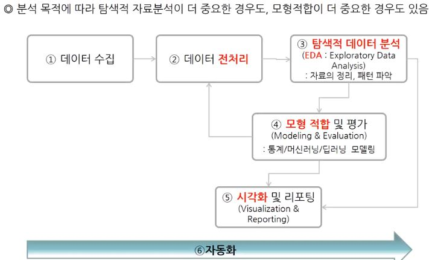

# 들어가기 전 

- 데이터사이언티스트와 데이터분석과  

</img>  
 
 - 데이터 분석 과정  
 
</img>  
 > 최근에는 이를 자동화하고 한번에 처리하기 위한 머신러닝 방법이 연구되고 있음 
 

# Brightics introduce

### 상관 분석(Correlation Analysis) 실습

- 산점도 (scatter plot)  
두 변수 간의 선형관계가 존재하는지 확인  
두 변수 간의 함수관계(직선, 곡선 관계)가 존재하는지  
outlier가 존재하는지< br>
몇 개의 그룹으로 나뉘어 구분할 수 있는지  

- 상관분석  
연속형 두 변수간의 선형관계 정도를 검정하는 통계 분석 방법

#### 상관 계수

1. 피어슨 상관계수(Pearson's Correlation Coefficient)  
> 두 변수간 선형관계의 방향과 강도가 어느 정도인지  
> -1 ~ 1 사이   
> ex) 온도와 전력 사용량  

2. 스피어만 상관계수(Spearman's Correlation Coefficient)  
> 서열척도인 두 변수들의 상관관계를 측정   
> ex) 대학교별 수능 평균점수 와 취업률 순위  

