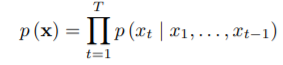
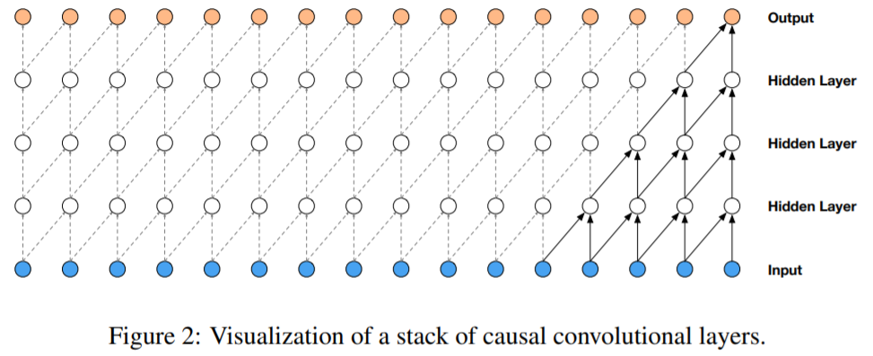
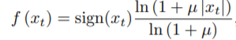
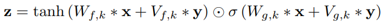

# WAVENET_A_GENERATIVE_MODEL_FOR_RAW_AUDIO

#### 메타 정보

- 19 Sep 2016 <br>
- 딥마인드에서 오디오 생성 모델인 wavenet에 관한 논문을 공개  <br>
- https://arxiv.org/pdf/1609.03499.pdf  <br>
- gif 출처 
https://deepmind.com/blog/article/wavenet-generative-model-raw-audio

### - ABSTRACT

- WaveNet은 원본 음성파형을 생성한는 딥러닝 모델이다. <br>
- 2016년도 당시 WaveNet을 통하여 TTS sota를 찍음 <br>

</img> <br>


```
이 당시 대부분의 TTS 모델은 녹음된 음성 데이터를 쪼개고 조합해서 음성을 생성하는 방식인 Concatenative TTS를 기반으로 구현되었습니다
-> 많은 데이터 필요, 아웃라이어 데이터나 새로운 환경의 데이터시에는 학습하기위해 다시 많은 데이터가 필요 
혹은 통계 기반의 음성을 생성하는 TTS기반으로 구현 

wavenet은 오디오의 파형을 직접 모델링하여 훨씬 자연스러운 음성을 생성.
```

### 1. INTRODUCTION

```
images (van den Oord et al.,2016a;b) and text (Jozefowicz et al., 2016)에서 아이디어를 얻어 WAVENET을 구상
WAVENET은 음성 생성모델 이고,  PixelCNN (van den Oord et al., 2016a;b)을 기반으로 작성됨  
```

> 해당 논문에서 소개할 내용 <br>

- WaveNet의 음성 신호 생성 모델에 대한 소개 <br>
- 긴 음성 데이터에 대한 처리 방법과 시간 제약 설명 <br>
- 화자분리 음성 데이터 생성 방법 소개 <br>
- 다른 모델과의 결과 비교 (+ 작은 데이터셋에서도 높은 성능을 보여줌) <br>

### 2. WAVENET

- joint probability 수식 <br>

</img> <br>

> Xt : 이전 시퀀스(음성)에 대한 timesteps -> 시계열 데이터 <br>
> 일반적인 시퀀스 데이터와 비슷하게 이전 시퀀스를 알면 다음 시퀀스를 예측할 수 있다 <br>

- model output : categorical distribution 결과를 softmax 씌운  Xt <br>
- optimize : maximize the log-likelihood

#### 2.1 DILATED CAUSAL CONVOLUTIONS

</img> <br>

```
convolution 네트워크를 기반으로 되어 있음.

일반적인 convolution network의 경우 시퀀셜한 데이터를 처리하기힘들기 때문에  introduction에서 PixelCNN을 언급하며 이야기를 꺼냄
wavenet에서는 위의 그림과 같이 오직 과거의 파형 정보만 접근할 수 있도록 causal convolutional layer를 여러겹 쌓았습니다.
실제 구현할 때에는 단순히 이전 층의 결과를 쉬프팅하면서 1d convolutional laeyr를 여러겹 쌓으면 된다. 
1-D 데이터를 사용하여 RNN혹은 전체 데이터에 대한 CNN에 비하여 연산량이 비교적 적음 

-> 문제점 발생 
위 그림에서 4개의 층을 쌓았자민 receptive field 가 5(layers + filter_length) 밖에 되지 않는 문제가 생김 
```

</img> <br>

```
     - stacked dilated convolutions
dilated convolutional layers를 사용하여 시퀀셜한 데이터 문제를 해결
데이터의 길이에 따라 dilation이 n으로 늘어남 -> receptive field 는 2^n 개 

논문에서 dilation을 512까지 1,2,4,8...512를 만드는 레이어를 3번 반복 해서 만듦
```

#### 2.2 SOFTMAX DISTRIBUTIONS

</img> <br>

```
- "van den Oord et al. (2016)"이 MCGSM보다 softmax distribution이 더 효과가 좋다고 함 
MCGSM : mixture of conditional Gaussian scale mixtures (픽셀 오디오등 한정된 데이터에서 적용되는걸로 보임) 
- categorical distribution 에서 더욱 좋은 교과를 보임
- 개별 오디오 샘플에 대한 조건부 분포를 모델링하는 방법중 하나 
- 데이터가 연속적인 경우에 softmax distribution이 다른 것들보다 잘 동작하는 경향이 있음 

    - 설명
일반적으로 오디오는 16bit 정수 값으로 저장하기 때문에 그대로 사용하면 스탭마다 65536개의 확률을 다뤄야 한다.
-> 이 수를 줄이기 위해서 u-law companding을 적용해서 256개 중 하나의 값으로 정량화
-> 비선형 정량화를 하면 재구성된 신호가 원래의 신호와 매우 유사함
-> loss function 은 cross entropy를 사용

단점 16비트의 quantization을 8 bit의 quantization을 사용함으로써 노이즈가 더 생기는 문제가 있음
-> 이문제를 해결하기 위해 

(2018) 알고리즘들 -> wavenet vocoder 를 해결하기 위한 알고리즘들
    - MDM WaveNet 
16bit를(6만5천개가량의 차원) 모두 사용하기엔 softmax의 확률값과 연산량의 증가로 너무 어려워짐.
음성의 분포를 파라미터가 가능한 분포로 모델링 한 후 모델에서 이 분포의 변수를 예측하는대 사용

    - EXCIT NET (SPEECH PRODUCTION MODEL)     
소리가 나가기전 구강에서 나는 소리와(성대), 성보, 방사(입술에서 나가는 소리)의 곱으로 해결을 함. 

    - LP-WAVENET
전제
1. wavenet은 과거 음성셈플이 현제 음성 셈플을 생성할때 주어지는 정보
2. wavenet 보코더가 스펙트럴 파트 or LP coefficients 또한 주어져있다고 가정
-> 즉, 그럼 두개의 linear combination 텀또한 같다고 가정할 수 있음. => 상수로 취금
```

#### 2.3 GATED ACTIVATION UNITS

</img> <br>

```
동그라미 2개 모양 : 행렬 곱
σ : sigmoid
k : layer index
f : filter
g : gate
W : 학습 convolution filter

tanh(Wfx * x) -> 의 결과를 시그모이드를 이용해서 얼마나 통과시킬지 조절 
sigmoid(Wgk * x) ->  요게 gate units 역할
PixcelCNN에서 사용하는 것과 같은 Gated Activation Unit을 사용.
```

#### 2.4 RESIDUAL AND SKIP CONNECTIONS

</img> <br>

```
network 에서  residual 과 skip connection을 사용하여 학습 
사진처럼 위의 레이어를 K개를 사용하여 학습 (병럴 수행 가능해보임)
위에서는 1*1이 하나로 되어있지만 블로그에서 1*1이 residual 용 skip-connections 따로 있음.
또 병렬로 쌓는게 아니라 수직으로 쌓여있는 모델 구조
```

#### 2.5 CONDITIONAL WAVENETS

</img> <br><br>
</img> <br>

```
h : 캐릭터 하나에 대한 잠재 벡터, Speaker의 특성 -> 모든 시점에서 결과 분포에 영향을 끼치는 h에 의해서 특징 지어 짐
* : convolution 연산자
K : layer 번호
f : filter
g : gate
V(*,k) : 학습가능한 linear projection 
V(f,k)*y : 1*1 convolution

위 식은 wavenet의 조건을 설정하는 전역적인 방법(global conditioning)과 지역적인 방법(local conditioning)이 있다. 
- 전역적인 방법
위의 식
주어진 조건 정보가 모든 스탭에 동일한 영향을 줌  
ex)화자에 대한 정보   
- 지역적인 방법
아래 식
시계열 ht로 주어졌을 때 activation function에 적용하기 위해서 ht의 타임 스탭 수를 오디오의 타임스탭 수와 똑같이 맞춰줘야함
이를 위해 transposed convolution을 사용하거나 단순히 각 스탭을 복제해서 맞춰줄 수 있습니다. 스탭 수를 맞춰준 조건 정보를 
y= f(h)
라고 할 때 activation function은 다음과 같이 변하게 됩니다.
Vf,k∗y 는 1x1 convoltion
``````

### EXPERIMENTS

</img> <br>

- MULTI-SPEAKER SPEECH GENERATION <br>
- TEXT-TO-SPEECH <br>
- MUSIC <br>
- SPEECH RECOGNITION <br>
- 실제 데이터 확인 <br>
https://deepmind.com/blog/article/wavenet-generative-model-raw-audio <br>
```
오디오 신호의 긴 부분을 처리하고 지역적으로 더 큰 WaveNet을 처리.
더긴 오디오 시간에 상관 관계를 모형화
```

### WaveNet의 단점

```
    - WAVEFORM DIVERGENCE PROBLEM
학습 시 과거의 음성셈플이 존재한다고 가정한다고 생각하고 학습하게됨
실제 인퍼런스 시 생성한 음성을 가지고 계속해서 생성해 나가다보니 문제가 생김
ex) 묵음 구간에서 wavenet은 에러가 더욱 많이 생기게 되고 많은 노이즈를 생성하게 됨
-> 해결책
적은양의 노이즈를 섞어서 학습시킴(1bit) -> 사람이 듣기에는 구분 불가

    - WAVEFORM GENERATION METHODS
WAVENET에서 따라서 확률분포를 얻게되는데 이를 어떻게 다루냐에 따라서 여러가지 sample generation 됨
1. RANDOM SAMPLING
음성 구간에서 노이즈한 결과가 나오는 문제가 있음
2. Argmax sampling
1번의 해결책 maximum likely hood 값을 가지는 샘플을 따라가도록 샘플링
unvoice구간이 잘 살지 않는 문제가 있음
3. Greedy sampling
음성 구간에서는 2번을 사용하고, un voice 구간에서는 1번을 사용하는 방법
4. Mode sampling -> (유튜브 보고 정리중 바표자가 제안한 방식)
un voice 구간에서는 1번을 사용 
voice 구간에서는 argmax대신 scale파라미터들을 조절을 해나가면서 랜덤샘플링을 진행
```


## 관련 지식 

### Skip connection

```
뉴럴넷은  H(x)−y 를 최소화 하는 방향으로 학습을 진행한다.
이때 Skip network 는 
입력과 출력의 잔차를  F(x)=H(x)−x 라고 정의를 하고 네트워크는 이  F(x) 를 찾는 것이다.
최적의 경우  F(x)=0 이 되어야하므로 학습의 목표가 이미 정해져 있기 때문에 학습 속도가 빨라짐.
네트워크가 잔차를 학습하고 나면, 입력값의 작은 변화에도 민감하게 반응한다는 가설
```

### masked convolution

- PixelCNN 논문에서 masked convolution 방법 제안

</img> <br>

- 필터를 마스크하기 위해서는 필터의 중심에서 우측과 아래의 가중치를 0 으로 셋팅

```
두가지 masked filter 를 사용
A. 필터의 중심도 가중치를 0 으로 셋팅
B. 필터의 중심의 값을 이용 
-> 이경우 위의 그림처럼 필터의 아래쪽 가중치를 0으로 셋팅해서 사용

A 타입은 첫 컨볼루션 레이어에서만 사용하고 나머지 레이어에서는 B를 이용한다.

- 내가 생각한
B타입처럼 필터의 아래부분 가중치를 0으로 두는 이유
-> CNN은 시계열 데이터를 처리할 수 없다.  -> 이를  처리하기 위해 필터의 아래부분 가중치를 0으로 치환 
ex) 연속된 사진을 붙여놓은 데이터 혹은 음성,NLP 데이터 라고 보면
위의 사진처럼 데이터의
```

- AR model(Autoregressive Model) <br>

</img> <br>

```
현재 시점의 정상 시계열 (ex: 페어 트레이딩의 스프레드)은 이전 시점의 정상 시계열에 상수 (a)를 곱해준 것과 유사하고, 잔차 정도의 차이만 있음을 모형화 한 것이다. 
이 모형을 AR (Autoregressive) 모형이라 하고 (자기회귀모형), 바로 이전 시점 (t-1 시점) 까지만 고려하면 AR(1), 
그 이전 까지 모두 고려해 주면 일반적으로 AR(p) 모형이라 한다.

[출처] 19. AR(1) 모형 (Autoregressive Model)|작성자 아마퀀트
```

### 장단점 정리

```
powerfull 한 generate model

단점 
1. 매우느림 
이유 : auto regresive 모델인데 audio의경우 매우 긴 입력데이터를 기반으로 하기때문에 
2. end-to-end 모델이 아님

```


## 참조
- WAVENET 논문 <br>
https://arxiv.org/pdf/1609.03499.pdf <br>
- pixelcnn 논문 <br>
https://papers.nips.cc/paper/6527-conditional-image-generation-with-pixelcnn-decoders.pdf <br>
- pixelcnn 설명 블로그 <br>
https://tensorflow.blog/2016/11/29/pixelcnn-1601-06759-summary/ <br>
- pixelcnn 설명 블로그  <br>
https://ratsgo.github.io/generative%20model/2018/01/31/AR/ <br>
- AR 모형 설명 블로그 <br>
https://blog.naver.com/PostView.nhn?blogId=chunjein&logNo=100173614389 <br>
- Skip connection 설명 <br>
https://datascienceschool.net/view-notebook/958022040c544257aa7ba88643d6c032/ <br>
- 유튜브 논문 리뷰 <br>
https://www.youtube.com/watch?v=GyQnex_DK2k&feature=youtu.be <br>
https://www.youtube.com/watch?v=m2A9g6Xu91I <br>
- wavenet 설명 블로그 <br>
http://www.secmem.org/blog/2019/08/18/wavenet/ <br>


