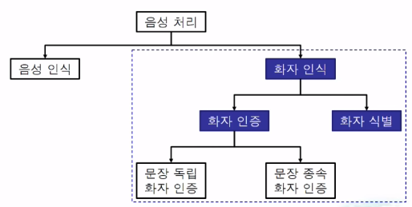

# naver d2 -  화자인식 기술 및 관련 연구 소개

### 화자인식 기술의 역사를 매우 잘 설명함

- url : https://www.youtube.com/watch?v=HzgCnlre4EE

</img> <br>

```
정통적인 음성처리 역사 

음석인식과 독립적으로 "화자 인식"이 존재 

    - 음성 인식
음성의 내용을 구분하는 것만을 목적으로 함
    - 화자 인식
무슨 말을 했냐보다는 어떤 사람이 말했는지를 구분 하는걸 목표로 함
    - 화자 식별(SID, speaker idetification)
등록 화자를 식별하는 방법 
등록된 N명중 가장 유사한 1명을 찾는 기술
-> 단점, 등록된 N명이 아닌 다른사람은 시스템이 인지할 수 없음
    - 화자 확인 혹은 화자 인증(SV, speaker verification) 
화자 식별의 문제점인 시스템이 등록되지 않은 사람을 확인하는 테스크
지정된 대상 화자가 맞다면 승인하는 시스템
```

> 문장 종속과 문장 독립

```
    - 문장 종속(texxt dependent)
문장 종속 화자 인식
등록/테스트 발성의 내용이 동일
상대적으로 높은 정확도를 내기 쉬움
(등록된 화자와 인증 요청 화자가 같음)
    - 문장 독립(text independet)
발성 내의에 무관하게 인식
상대적으로 높은 정확도를 내기 어려움
```

> 화자 인식 연구의 흐름 

</img> <br>

> GMM(Gaussian mixture model)

```
화자 식별 시스템 -> MFCC를 사용
MFCC : 음성을 매우 작은 단위로 나누어 사용 -> 빠르게 변화하는 음성 신호를 잘 잡아내기 위해서
+ FFT 의 짧은 구간에 대한 주파수 분석을 토대로 사용

한 화자의 등록 발성에서 추출한 MFCC를 다수의 Gaussian mixture로 모델링
```

> 1995 D.Reynolds

```
KING speech DB
- 특징
테스트 발성 길이가 짧아지면 식별률 저하 (데이터 증가, 컴포넌트 개수가 늘어나더라도 낮은 식별률이 나옴)
-> 사용자에게 90초 이상의 발성을 요구할 수 없어 실제로 서비스로 사용하기에는 어려움 
화자 모델 학습 데이터가 줄어들면 식별률 저하
```

> 2000 가우시안 혼합 모델(GMM) 기반 화자 인증 시스템 D.Reynolds

```
하나의 배경 화자 모델(UBM)을 사용
각 대상 화자 모델은 배경 화자 모델로부터 MAP적응
    식별 대상 화자 외의 다수의 배경 화조로 학습 세트 구성
    배경 화자 데이터 전체로 하나의 GMM 학습
    각 화자의 데이터로 GMM을 적응 학습
    데이터 부족 문제 회피
    화자 모델과의 유사도 / 배경 모델과의 유사도
```

> 2006 W. M. Campbel

```
그전 모델의 단점은 화자인식의 발성 단위로 인식하기 때문에 작은 프라임단위로 화자 인식을 수행하기 힘듦
- GSV 와 SVM 을 이용한 화자 인증 시스템을 제안
```

> 2007 P. Kenny

```
GSV를 speaker factor와 channel factor로 분리하여 모델링
```

> 2009 N.Dehak - i-vector

```
발성의 GSV를 저차원 total variability space 상의 한 벡터로 나타냄
화자/채널 요인을 분리하지 않음
JFA와의 차이점
채널 차이를 전혀 고려하지 않음 -> 뒷단에서 분류를 위한 보상을 추가할 필요가 있음 
```

> 전체 요약 2000 ~ 2009 년 흐름 전체 요약

</img> <br>

> 2011 N.Dehak

```
머신러닝 기술을 이용하기 시작
WCCN(within-class covariance covariance normalization) 과 i-vector 와 LDA 시각화등 다양하게 사용되기 시작

score 링을 정교하게 하게 하기 위해 s-norm 을 제안
체널과 speaker 팩터를 분리하여 score를 적용
```

> 전체 요약 2010년 이후의 흐름 전체 요약
</img> <br>

> i-vector 추출 과정

```
음성 신호 (발성) -> 프레임 단위 특징(음향 특징) -> 발성 단위 특징(GSV -> i-vector)
```

> PLDA scoring

```
한 화자의 i-vector들은 LDA 부공간 상에서 가우시안 분포를 따름
-> 두 i-vector가 얼마나 멀리 떨어져 있는지를 확률적으로 비교 하는 방법
```

### 심층 신경망의 적용

> 2014 DNN/i-vector -> Y. Lei

```
i-vector 추출시 각각의 mixture들의 의미를 궁굼해 하기시작함 
-> GMM이 음소 모델링을 하는 과정임을 알고 해당 과정을 DNN으로 대체하기 싲가
```

> 2015 H. Yamamoto

```
짧은 발성 i-vector를 긴 발성 i-vector의 corrupted feature로 간주 
-> Neural network으로 이를 복원 (짧은 발성을 긴 발성으로 변형)

=> 2017 I.H Yang 이를 좀더 개선한 논문을 제안
PCA축을 따라 변형
```

> 2014 H.S Lee

```
b-vector 기반 시스템
DNN을 분류기로 사용
두 발성으로부터 추출한 b-vector를 이진 분류(동일인 vs 비동일인)
두 발화의 특징을 분류 자동화
```

</img> <br>

### 여기서부터 딥러닝

> 화자 인증 시스템 전체를 DNN으로 대체하는 연구가 시작됨 

- 이전에는 충분한 데이터가 있지 않았기 때문에 

> 2014 E. Variani

```
d-vector -> i-vector를 사용하지않고 딥러닝을 통한 d-vector를 사용하기 싲가
```

> DNN 학습 방법 변경

```
    - 2016 G. Heigold
화자 식별을 수행하도록 학습 -> 화자 인증을 수행하도록 학습
(Softmax loss -> end-to-end loss로 변경)

    - 2018 J. W. Jung
별도의 특징 추출 과정 없이 화자인증 수행
Raw waveform과 1D CNN을 활용
``` 

> 기업법 최신 연구 방법

```
    - Microsoft
hey Cortana 음성의 문장 종속 화자인증
16K의 화자의 발성 데이터로 학습

    - Baidu
2017년 논문 Deep speaker : an end-to-end neural speaker embedding system
Xiaodu, xiaodu 와 음성 검색 발성의 화자인증
등록된 발성과 사칭자의 발성을 멀리 동일하면 가깝게하는 특징
250K 화자 발성 사용 (문장 독립 화자인증)
12K 화자의 검색 발성 활용(문장 종속 화자인증)

    - Apple
2018년도 논문 : GENERALISED DISCRIMINATIVE TRANSFORM VIA CURRICULUM LEARNING FOR SPEAKER RECOGNITION
Hey siri 와 명령어 발성의 화자인증
원거리 음성도 고려한 화자 인증 시스템 
헤이 시리 ~~~ 해줘 처럼 인증 + 요청사항을 수행할 수 있도록 새로운 러닝 기법을 제안
문장종속 학습 후 문장 독립 테스트를 학습하는 방법

    - Google
630k 화자의 OK Google
18K 화자의 OK/Hey google 을 통한 화자 인증 시스템
다른 기업보다 월등히 많은 양의 데이터를 사용
Generalized end-to-end loss를 사용하여 기존의 triplet loss를 개선
    -> 화자의 발성거리를 조절, 동시의 다수의 화자를 고려 
    
(Hey google 데이터가 더 적어 ) 둘다 잘 인식하기 위해 Multi reader 기법을 만듬
```


# Deepest 여름 학교 2017 - 딥러닝과 음성인식

- url : https://www.youtube.com/watch?v=mAjvfIh2iXw


